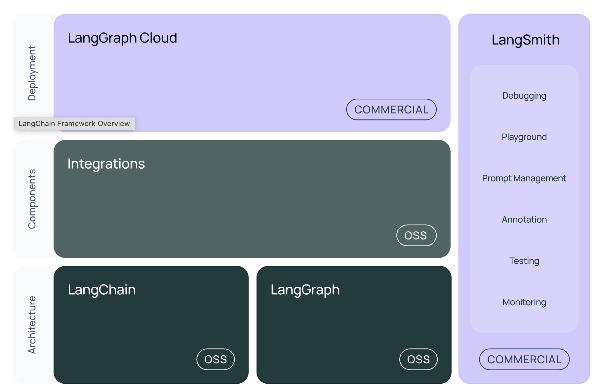

# LangChain Concepts

## Conceptual Gide

### Architecture

LangChain as a framework consists of a number of package.

`langchain-core`
This package contains base abstractions of different components and ways to compose them together. The interfaces for core components like LLMs, vector stores, retrievers, and more are defined here. No third party integrations are defined here. The dependencies are kept purposefully very lightweight.

`langchain`

The main `lnagchain` package contains chains, agents, and retrieval strategies that make up an application's cognitive architecture. These are **not** third party integrations. All chains, agents, and retrieval strategies here are **not** specific to any one integration, but rather generic across all integrations.

`langchain-community`

This package contains third-party integrations that are maintained by the LangChain community. Key partner packages are separated out. This contains all integrations for various components (LLMs, vector stores, retrievers). All dependencies in this package are optional to keep the package lightweight.

#### Partner packages

While `langchain-community` shares some common components for all partner packages, we split popular integrations into their own packages e.g. `langchain-openai`, `langchain-anthropic`, etc. This was done in order to improve support for these key integrations.

`langgraph`

`langgraph` is an extension of `langchain` aimed at building robust and stateful mulit-actor applications with LLMs by modeling steps as edges and nodes in a graph.

LangGraph exposes high level interfaces for creating common types of agents, as well as a low-level API for composing custom flows. 

`langserve`

A package to deploy LangChain chains as REST APIs. Makes it easy to get a production ready API up and running.

##### LangSmith

A developer platform that lets you debug, test, evaulate and monitor LLM applications.

