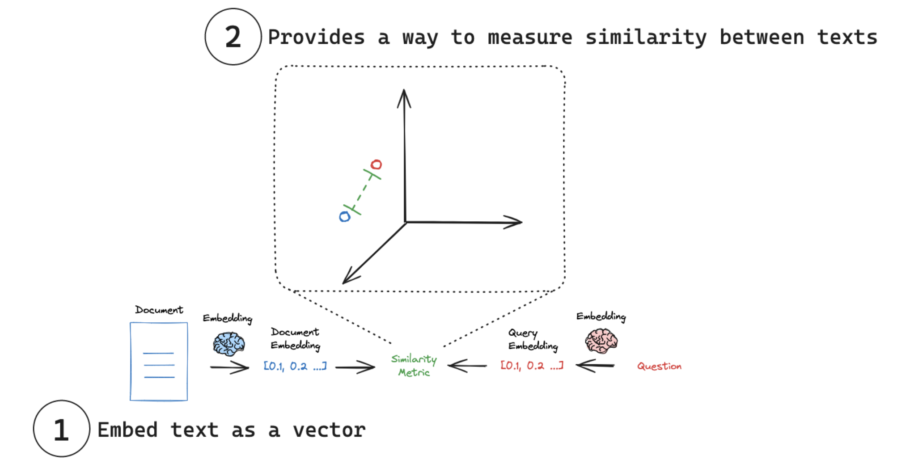

## LangChain Retrievers

### Some Preliminaries

#### Embedding Models

Embedding models capture the essence of any text- a tweet, document, or book in a single, compact representation. These models take text as an input and produce a fixed-length array of numbers, a numerical fingerprint of the text's semantic meaning. Embeddings allow search system to find relevant documents not just based on keyword matches, but on semantic understanding. 

<ins>Concepts</ins>

(1) **Embed text as a vector**: Embeddings transform text into a numerical vector representation.

(2) **Measure similarity**: Embedding vectors can be compared using simple arithmetic operations

<ins>Historical Context</ins>

<ins> A bit of information on BERT</ins>

Bidirectional Encoder Representations from Transformers (BERT) was developed by Google as a way to pre-train deep bidirectional representations from unlabeled text by jointly conditioning on both the left and right context in all layers. It was released under an open source license in 2018. Google has described BERT as the first deeply bidirectional, unsupervised language representation, pre-trained only with plain text corpus in the article ["BERT: Pretraining of Deep Bidirectional Transformers for Language Understanding, Jacob Devlin et al, Google AI Language, 2018"](https://github.com/dimitarpg13/langchain_tutorial/blob/main/articles/BERT-Pre-training_of_Deep_Bidirectional_Transformers_for_Language_Understanding_Devlin_2018.pdf)
