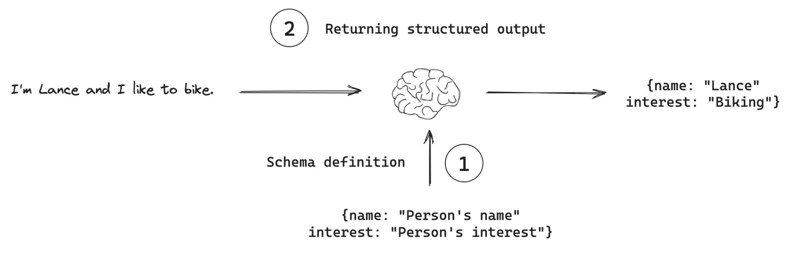
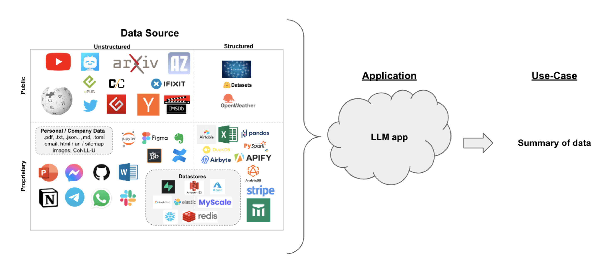
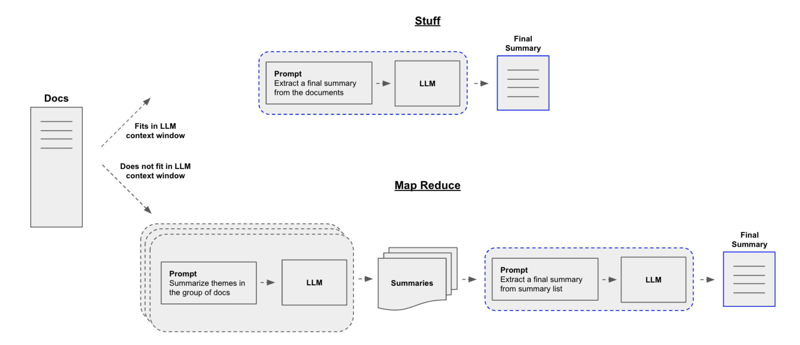

# LangChain Use Cases

## Some Preliminaries

### Chat models

Large Language Models (LLMs) are ML models used in a wide range of language-related tasks such as text generaton, translation, summarization, question answering, and more, without task-specific fine tuning for every scenario. 
LLMs are typically accessed through a chat model interface that takes a list of messages as input and returns a message as an output.

//TODO: finish the section on Chat models

### Messages

//TODO: finish the section on Messages

### LangChain Expression Language (LCEL)

LangChain Expression Language (LCEL) is a declarative way to easily compose chains together. LCEL was designed to support putting prototypes in production , with no code changes. LCEL can be used from the simplest "prompt + LLM" chain to the most complex chains having hundreds of steps. 

**Benefits of using LCEL**

* _Streaming support_ :  short time-to-first-token, that is time elapsed until the first chink of output comes out, is acichieved with LCEL chains.
  this means that the parser output from the streamed tokens from LLM to a streaming output parser is produced with the same rate as the LLM provider raw token output.

* _Async support_ : An LCEL chain can be called with both the synchronouus API (e.g. in Jupyter notebook while prototyping) as well as with asyncrhonous API (e.g. in a `LangServe` server); The same code can be used both for prototyping (syncrhonously) and in production (asynchronously) with server-level concurrency implemented in both cases. 

* _Optimized parallel execution_ : Whenever LCEL chains have steps that can be executed in parallel  e.g. if you fetch documents from multiple retrievers, parallel execution is implemented whenever it makes sense and it is optimized for minimal latency.

* _Retries and fallbacks_ : can be configured for any part of the LCEL chain.

* _Access intermediate result_ : for more complex chains it is often very useful to access the results from intermediate steps even before the final output is produced. This is useful for debugging or even presenting the end-users with more detailed step-level intermediate info.  

* _Input and output schemas_ : Input and output schemas give every LCEL chain Pydantic and JSONSChema schemas inferred from the structure of the chain.

* _LangSmith integration and tracing_ : with LCEL, all steps are automatically logged to `LangSmith` for maximum observability and ease of debugging


### Chains

Chains refer to sequences of calls - whether to an LLM, a tool, or a data preprocessing step. The primary way to implement a chain is by using LCEL but legacy chains are still supported. 
Using LCEL one can construct and implement custom chains but off-the-shelf chains are available as well. There are two types of off-the-shelf chains that LangChain supports:

* Chains that are built with LCEL. In this case LangChain offers a higher-level constructor method. However, all that is being done under the hood is constructing a chain with LCEL.

* Legacy Chains constructed by subclassing from legacy `Chain` class. These chains do not use LCEL under the hood but are standalone classes.

<ins>Note</ins>: Ongoing work is aiming at replacing all Legacy Chains with the LCEL implementations of those. This is done for the following reasons:

1) uniform and consistent way to introduce changes in the chain logic by using LCEL
2) native support for streaming, async and batch mode
3) automatic observability support through LangSmith intergation

#### LCEL Chains

**LCEL chain constructors**

`create_stuff_documents_chain`: creates a chain for passing a list of documents to a model

The function signature:
```
langchain.chains.combine_documents.stuff.create_stuff_documents_chain(
   llm: Runnable[
      Union[PromptValue, str, Sequence[Union[BaseMessage, List[str], Tuple[str, str], str, Dict[str, Any]]]],
      Union[BaseMessage, str]
   ],
   prompt: BasePromptTemplate, *,
   output_parser: Optional[BaseOutputParser] = None,
   document_prompt: Optional[BasePromptTemplate] = None,
   document_separator: str = '\n\n',
   document_variable_name: str = 'context'
) → Runnable[Dict[str, Any], Any]
```

Input Parameters:
* `llm` - the language model
* `prompt`  - the prompt template.
* `output_parser` - defaults to `StrOutputParser`
* `document_prompt` - prompt used for formatting each document into a string. Input variables can be "page_content" or any metadata keys that are in all documents.
  "page_content" will automatically retrieve the `Document.page_content`, and all other input variables will be automatically retrieved from the `Document.metadata`
   dictionary. Defaults to a prompt that only contains `Document.page_content`.
* `document_separator` - string separator to use between formatted document strings.
* `document_variable_name` - variable name to use for the formatted documents in the prompt. Defaults to "context".

Returns: an LCEL Runnable. The input is a dict that must have a "context" key that maps to a `List[Document]`, and any other input variables expected in the prompt. The Runnable return type depends on `output_parser` used.

**Example**:

```python
# pip install -U langchain langchain-community

from langchain_community.chat_models import ChatOpenAI
from langchain_core.documents import Document
from langchain_core.prompts import ChatPromptTemplate
from langchain.chains.combine_documents import create_stuff_documents_chain

prompt = ChatPromptTemplate.from_messages(
    [("system", "What are everyone's favorite colors:\n\n{context}")]
)
llm = ChatOpenAI(model="gpt-3.5-turbo")
chain = create_stuff_documents_chain(llm, prompt)

docs = [
    Document(page_content="Jesse loves red but not yellow"),
    Document(page_content = "Jamal loves green but not as much as he loves orange")
]

chain.invoke({"context": docs})

```

#### Legacy Chains

**MapReduceDocumentChain**


- [ ] TODO: finish the section on Legacy Chains

### Structured outputs

For many applications, such as chatbots, models need to respond to users directly in natural language. However, there are scenarios where we need models to output in a _structured format_. For example, we might want to store the model output in a database and ensure that the output conforms to the database schema. This need motivates the concept of structured output, where models can be instructed to respond with a particular output structure.



**Concepts in structured output**

1) **Schema definition**: the output strcuture is represented as a schema, which can be defined in several ways. 

2) **Returning structured output**: the model is given this schema, and is instructed to return output that conforms to it.

**Recomended usage**:

the code excerpt below illustrates the recommended workflow when using structured output. LangChain provides a method, `with_structured_output()`, that automates the process of binding the schema to the model and parsing the output. This helper function is available for all model providers that support structured output.

```python
# Define schema
schema = {"foo": "bar"}
# Bind schema to model
model_with_structure = model.with_structured_output(schema)
# Invoke the model to produce structured output that matches the schema
structured_output = model_with_structure.invoke(user_input)

```


#### Returning structured data from a model

We want to have a model return output which matches specific schema 


## Summarization

**Use Case Description**
Suppose you have a set of documents (PDF's, `Notion` document pages, customer questions, etc.) and you want to summarize the content.




<ins>Question:</ins>

How to pass the documents to be summarized to the LLM's context window?
Two comon approaches:

1. The _Stuff All Together_ approach: put all documents in a single prompt. This is the simplest approach but it comes with shortcomings.

2. The _Map-Reduce_ approach: summarize each document separately in a "map"
 step and then "reduce" the summaries into a final summary.


