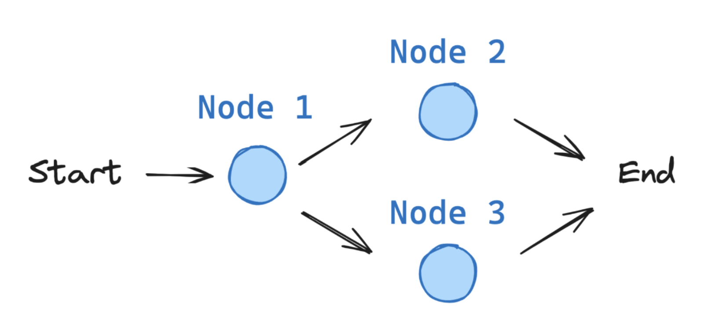

# Resource on graphs utilizing memory

## First Step: Construct a Simple Graph

<!--  -->


In order to define simple graph with LangChain first we need to deal with [the State of the graph](https://langchain-ai.github.io/langgraph/concepts/low_level/#state).

### The State of the Graph

The `State` of the graph consists of the _Schema_ of the Graph as well as _Reducer Functions_. Both are defined in the next sections.
The `State` in LangGraph can be a `TypedDict`, `Pydantic` model, or a dataclass. 

Let us consider a simple example using _messages_.

### Working with Messages in Graph State

Most modern LLM providers have a chat model interface that accepts a list of messages as input. LangChain's `ChatModel` in particular accepts a list of `Message` objects as inputs. These messages come in a variety of forms such as `HumanMessage` (user input) or `AIMessage` (LLM response). 

We can store prior conversation history as a list of messages in the graph state of our graph implementation. To do so, add a key (channl) to the graph state that stores a list of `Message` objects and annotate it with reducer function. 
  Additionally, we can manually add messages in graph state (e.g. human-in-the-loop) if we use `operator.add`. 
  If we want to manually update existing messages we need to a reducer that can keep track of message IDs and overwrite existing messages if updated. For this purpose we can use the prebuilt `add_messages` function. For brand new messages `add_messages` will simply append those to the existing list, but it will also handle the updates of the existing messages correctly. In addition to keeping track of message IDs, the `add_messages` function will also try to deserialize messages into LangChain `Message` object whenever a state update is receieved on the `messages` channel. Thus the graph inputs/state updates have the following format:

```python
# this is supported
{"messages": [HumanMessage(content="message")]}

# and this is also supported
{"messages": [{"type": "human", "content": "message"}]}
```

Here is Graph State defined for handling Messages

```python
from langchain_core.messages import AnyMessage
from langgraph.graph_message import add_messages
from typing import Annotated
from typing_extensions import TypedDict

class graphState(TypedDict):
    messages: Annotated[list[AnyMessage], add_messages]
```

Since having a list of messages in the graph state is common there exist a prebuilt state `MessagesState` which makes it easy to use messages. `MessagesState` is defined with a single `messages` key which is a list of `AnyMessage` objects and uses the `add_messages` reducer. Here is a typical useage of this class with subclassing which adds more fields:

```python
from langgraph.graph import MessagesState

class State(MessagesState):
    documents: list[str]
```


### The Schema of the Graph

The schema of the `State` will be input schema to all `Nodes` and `Edges` in the graph, and can be either a `TypedDict` or a `Pydantic` model.  All `Nodes` will emit updates to the `State` whic are then applied using the specified `reducer` function.

LangChain supports the [Pydantic BaseModel](https://docs.pydantic.dev/latest/api/base_model/) as a graph state to add _default values_ and additional data validation. 

By default , the graph will have the same input and output schemas. This default can be changed by specifying the input and output schemas explicitly. This is useful when the schema has a lot of keys and some need to be explicitly for input only while others need to be explicitly specified for output only. 

#### Multiple schemas

Typically, all graph nodes communicate with a single schema. This means that they will read and write to the same state channels. But, there are cases where more  control is needed:

* Internal nodes can pass information that is not required in the graph's input / output.

* different input / output schemas for the graph are needed. The output, for example, could only contain a single relevant output key.

It is possible to have nodes wrote to private state channels within the graph for internal node communication. In such case we define a private schema, `PrivateState`. 


**Passing private state between nodes**

We want internal nodes to exchange information that is crucial for intermediate logic but does not need to be part of the main schema of the graph. 
In the example below we create sequential graph consisting of `node_1`, `node_2`, and `node_3`, where private data is passed between `node_1` and `node_2` while `node_3`, which is the output, has access to the public overall state

The notebook with this example can be found [here](https://github.com/dimitarpg13/langchain_tutorial/blob/main/langchain_tutorial/notebooks/private_state/SimplePrivateState.ipynb).
